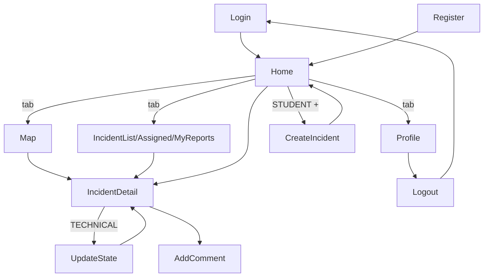

# CityFix Mobile — Disseny Sprint 4

Document d'inventari, navegació i wireframes per a l'aplicació mòbil. Pensat per iterar-hi: edita el que no t'agradi, marca el que vulguis canviar, i després es tradueix a codi React Native + NativeWind.

---

## 1. Rols i enfocament mòbil

| Rol | Ús principal al mòbil |
|---|---|
| **STUDENT** | Crear incidències, veure les seves, guanyar punts |
| **TECHNICAL** | Veure assignades, actualitzar estat, afegir resolució |
| **ADMIN** | Gestió principal al dashboard web; al mòbil només consulta |

> La gestió administrativa pesada (gestionar usuaris, analytics) queda al dashboard web. El mòbil es centra en el flux de camp: reportar i resoldre.

### Model d'assignació (decidit)

Només l'**ADMIN** pot assignar incidències a tècnics (via dashboard web). Els TECHNICAL no es poden auto-assignar: veuen al mòbil només les incidències que ja tenen assignades i poden actualitzar-ne l'estat (`ASSIGNED` → `IN_PROGRESS` → `VALIDATED` / `CLOSED`). Això simplifica els permisos del backend i l'UI del mòbil.

---

## 2. Inventari de pantalles

### Compartides (tots els rols)
- `Login` ✅ (fet)
- `Register` ✅ (fet)
- `Home` — dashboard adaptat al rol
- `Map` — mapa del campus amb incidències
- `IncidentList` — llista filtrable d'incidències
- `IncidentDetail` — detall + comentaris + imatges
- `Profile` — info usuari + logout
- `Notifications` — (opcional v2)

### Només STUDENT
- `CreateIncident` — càmera, categoria, ubicació, descripció
- `MyReports` — filtrat de les seves
- `Leaderboard` — (opcional) rànquing de punts

### Només TECHNICAL
- `AssignedReports` — pendents d'atendre
- `UpdateState` (dins Detail) — canviar estat, afegir fotos de progrés/resolució

---

## 3. Estructura de navegació

### Tab bar (inferior) per rol

**STUDENT**
```
┌─────────┬─────────┬─────────┬─────────┬─────────┐
│  Home   │   Map   │   (+)   │  Meves  │ Perfil  │
│   🏠    │   🗺️   │ Reportar │   📋   │   👤    │
└─────────┴─────────┴─────────┴─────────┴─────────┘
```

**TECHNICAL**
```
┌─────────┬─────────┬──────────┬─────────┐
│  Home   │   Map   │ Assigna- │ Perfil  │
│   🏠    │   🗺️   │   des    │   👤    │
└─────────┴─────────┴──────────┴─────────┘
```

**ADMIN**
```
┌─────────┬─────────┬───────────┬─────────┐
│  Home   │   Map   │ Totes les │ Perfil  │
│   🏠    │   🗺️   │ incidèn.  │   👤    │
└─────────┴─────────┴───────────┴─────────┘
```

### Flow general (Mermaid)



---

## 4. Wireframes per pantalla

### 4.1 Home (STUDENT)

```
┌───────────────────────────────┐
│ ☰   CityFix            🔔     │  ← topbar
├───────────────────────────────┤
│                               │
│ Bon dia, Albert 👋            │
│ Tens 124 punts                │
│                               │
│ ┌───────────────────────────┐ │
│ │  🏆 +20 pts aquesta set.  │ │  ← card gamificació
│ └───────────────────────────┘ │
│                               │
│ Accions ràpides               │
│ ┌─────────┬─────────┐         │
│ │  [+]    │   🗺️    │         │
│ │ Reportar│ Mapa    │         │
│ └─────────┴─────────┘         │
│                               │
│ Les meves incidències (3)     │
│ ┌───────────────────────────┐ │
│ │ 💡 Fanal trencat  [OPEN]  │ │
│ │ Fa 2 dies · Pl. Cívica    │ │
│ ├───────────────────────────┤ │
│ │ 🚧 Clot camí  [RESOLVED]  │ │
│ │ Fa 5 dies · Facultat Econ.│ │
│ └───────────────────────────┘ │
│ → Veure totes les meves       │
│                               │
├───────────────────────────────┤
│  🏠    🗺️    [+]    📋    👤 │
└───────────────────────────────┘
```

### 4.2 Home (TECHNICAL)

```
┌───────────────────────────────┐
│ ☰   CityFix            🔔     │
├───────────────────────────────┤
│                               │
│ Hola, Maria 🔧                │
│ 5 incidències assignades      │
│                               │
│ Estat de la meva càrrega      │
│ ┌───────────────────────────┐ │
│ │ Pendents    [2] ▓▓░░░░░░ │ │
│ │ En curs     [2] ▓▓▓▓░░░░ │ │
│ │ Resoltes avui [1]         │ │
│ └───────────────────────────┘ │
│                               │
│ Properes a atendre (per prio.)│
│ ┌───────────────────────────┐ │
│ │ 🔴 CRÍTICA · 💡 Fanal      │ │
│ │ Pl. Cívica · Fa 4h         │ │
│ ├───────────────────────────┤ │
│ │ 🟠 ALTA · 🚧 Vorera        │ │
│ │ Fac. Dret · Fa 1d          │ │
│ └───────────────────────────┘ │
│ → Veure totes assignades      │
│                               │
├───────────────────────────────┤
│  🏠    🗺️    📋    👤         │
└───────────────────────────────┘
```

### 4.3 Map

```
┌───────────────────────────────┐
│ ← Mapa          ⚙️ filtres   │
├───────────────────────────────┤
│ 🔍 [Cerca per zona...]       │
│                               │
│  ┌─────────────────────────┐  │
│  │                         │  │
│  │      🔴        🟢       │  │  ← pins per estat/prioritat
│  │                         │  │
│  │   🟠      📍 (tu)       │  │
│  │                         │  │
│  │         🟢              │  │
│  │                         │  │
│  │              🔴         │  │
│  └─────────────────────────┘  │
│                               │
│ Llegenda:                     │
│ 🔴 Crítica  🟠 Alta  🟡 Mitj. │
│ 🟢 Resolta  🔵 En curs        │
├───────────────────────────────┤
│  Tab bar                      │
└───────────────────────────────┘
```

En tocar un pin → card flotant amb preview + botó "Veure detall".

### 4.4 IncidentList (i variants: MyReports, AssignedReports)

```
┌───────────────────────────────┐
│ ← Incidències         + Crear │  ← el "+Crear" només STUDENT
├───────────────────────────────┤
│ [Totes][Obertes][En curs][✓] │  ← chips filtre estat
│ [Totes categories ▾]          │
│                               │
│ ┌───────────────────────────┐ │
│ │ 🔴 Fanal trencat          │ │
│ │ 💡 Il·luminació           │ │
│ │ 📍 Pl. Cívica · fa 2h     │ │
│ │ [OBERTA]                  │ │
│ ├───────────────────────────┤ │
│ │ 🟠 Banc trencat           │ │
│ │ 🪑 Mobiliari              │ │
│ │ 📍 Fac. Lletres · fa 1d   │ │
│ │ [ASSIGNADA → Joan T.]     │ │
│ ├───────────────────────────┤ │
│ │ 🟡 Paperera plena         │ │
│ │ 🧹 Neteja                 │ │
│ │ 📍 Pl. Cívica · fa 3d     │ │
│ │ [EN CURS]                 │ │
│ └───────────────────────────┘ │
│                               │
│ [scroll infinit / paginació] │
├───────────────────────────────┤
│  Tab bar                      │
└───────────────────────────────┘
```

### 4.5 IncidentDetail

```
┌───────────────────────────────┐
│ ← Detall          ⋮ (opcions)│
├───────────────────────────────┤
│ ┌───────────────────────────┐ │
│ │     [ FOTO PRINCIPAL ]    │ │  ← carrusel d'imatges
│ │         ● ○ ○             │ │
│ └───────────────────────────┘ │
│                               │
│ Fanal trencat                 │  ← títol
│ 💡 Il·luminació · 🔴 CRÍTICA  │
│ [OBERTA]                      │  ← badge estat
│                               │
│ Descripció                    │
│ El fanal de la plaça central  │
│ porta 2 dies apagat, zona     │
│ molt fosca de nit.            │
│                               │
│ 📍 Ubicació                   │
│ ┌───────────────────────────┐ │
│ │  [minimapa amb pin]       │ │
│ └───────────────────────────┘ │
│ Plaça Cívica, UAB             │
│                               │
│ 👤 Reportat per @albert.v     │
│ 📅 Fa 2 hores                 │
│ 🔧 Assignat a: —              │
│                               │
│ ─ Comentaris (3) ─            │
│ ┌───────────────────────────┐ │
│ │ @maria_tec · fa 1h        │ │
│ │ Anem-hi aquesta tarda     │ │
│ └───────────────────────────┘ │
│                               │
│ [Escriu un comentari...]  📤 │
│                               │
│ ┌───────────────────────────┐ │
│ │ TECHNICAL: Canviar estat  │ │  ← visible només si està
│ │ [En curs] [Validar] [✓]   │ │    assignat a aquest tècnic
│ └───────────────────────────┘ │
└───────────────────────────────┘
```

### 4.6 CreateIncident (només STUDENT)

```
┌───────────────────────────────┐
│ ← Nova incidència      Enviar │
├───────────────────────────────┤
│                               │
│ Foto *                        │
│ ┌─────────┬─────────┐         │
│ │   📷    │   🖼️    │         │
│ │ Càmera  │ Galeria │         │
│ └─────────┴─────────┘         │
│ [ preview foto si s'afegeix ] │
│                               │
│ Títol *                       │
│ [________________________]    │
│                               │
│ Categoria *                   │
│ [ Il·luminació          ▾ ]   │
│                               │
│ Descripció *                  │
│ ┌───────────────────────────┐ │
│ │                           │ │
│ │                           │ │
│ └───────────────────────────┘ │
│                               │
│ Ubicació *                    │
│ ◉ Usar la meva ubicació       │
│ ○ Seleccionar al mapa         │
│ 📍 Pl. Cívica (41.50, 2.10)   │
│                               │
│ Prioritat suggerida           │
│ ○ Baixa ◉ Mitjana ○ Alta     │
│                               │
│ [     Enviar incidència    ]  │
└───────────────────────────────┘
```

### 4.7 UpdateState (modal/bottom sheet dins Detail, TECHNICAL)

```
┌───────────────────────────────┐
│        Actualitzar estat   ✕ │
├───────────────────────────────┤
│                               │
│ Estat actual: [ASSIGNADA]     │
│                               │
│ Canviar a:                    │
│ ○ En curs                     │
│ ◉ Validada                    │
│ ○ Tancada                     │
│                               │
│ Foto resolució (opcional)     │
│ ┌─────────┬─────────┐         │
│ │   📷    │   🖼️    │         │
│ └─────────┴─────────┘         │
│                               │
│ Comentari (opcional)          │
│ ┌───────────────────────────┐ │
│ │                           │ │
│ └───────────────────────────┘ │
│                               │
│ [        Confirmar         ]  │
└───────────────────────────────┘
```

### 4.8 Profile

```
┌───────────────────────────────┐
│          Perfil               │
├───────────────────────────────┤
│                               │
│        ┌─────────┐            │
│        │   AV    │            │  ← avatar (inicials)
│        └─────────┘            │
│     Albert Vacas              │
│     @albert.v                 │
│     🎓 Estudiant UAB          │
│                               │
│ ┌───────────────────────────┐ │
│ │ 🏆  124 punts             │ │
│ │ 📊  8 incidències reports.│ │
│ │ ✅  5 resoltes gràcies... │ │
│ └───────────────────────────┘ │
│                               │
│ ─ Configuració ─              │
│ ⚙️  Preferències              │
│ 🔔  Notificacions             │
│ 🌍  Idioma (Català)           │
│ ℹ️   Sobre CityFix            │
│                               │
│                               │
│ [     Tancar sessió        ]  │
└───────────────────────────────┘
```

---

## 5. Paleta i consistència visual

- **Primari:** brand-600 (blau UAB) per accions principals i estats actius.
- **Estats d'incidència** (color semàntic per badge):
  - `OPEN` → gris
  - `ASSIGNED` → groc
  - `IN_PROGRESS` → blau
  - `VALIDATED` → lila
  - `CLOSED` → verd
- **Prioritats:**
  - `LOW` → gris clar
  - `MEDIUM` → groc
  - `HIGH` → taronja
  - `CRITICAL` → vermell
- **Categories:** cadascuna amb icona (💡 🪑 🚧 🧹 🌳 🪧 ♿ 💻 …).
- **Espai:** generos, cards amb `rounded-xl` + `p-4`, separació `mb-4` entre blocs.
- **Tipografia:** títols `text-2xl font-bold`, cos `text-base`, meta `text-xs text-gray-500`.

---

## 6. Preguntes obertes (decideix tu)

1. **Comentaris:** els volem per a tothom o només TECHNICAL/reporter?
2. **Gamificació:** mostrem leaderboard o només punts individuals?
3. **Notificacions push:** les entrem en aquesta iteració o ho deixem per a v2?
4. **Categories vs. icones:** emojis està bé per prototip? Després es poden substituir per SVGs.
5. **Idioma:** tot en català o afegim selector ES/EN des de l'inici?

### Decidides
- **Assignació d'incidències:** només ADMIN (des del dashboard web). TECHNICAL no pot auto-assignar-se.
- **ADMIN al mòbil:** només consulta (Home, Map, llistat). Les assignacions i gestió d'usuaris es fan al dashboard web.

---

## 7. Següents passos

Un cop validis aquests wireframes:
1. Crear l'estructura de carpetes de pantalles a `app/app/(app)/`.
2. Implementar el tab bar adaptat per rol.
3. Construir pantalles amb dades dummy (mocks).
4. Iterar visualment a l'emulador.
5. Connectar al backend (endpoints ja existents).

> Marca amb `~~text~~` el que vulguis eliminar, escriu comentaris amb `> NOTA:` i quan estiguis d'acord passem al codi.
